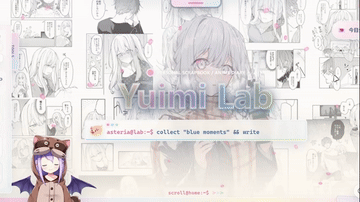

<div align="center">

<h1>
  Mikan KenkyuuSho
  
</h1>

**一个以二次元手账与个人日记为核心的 Astro 博客，基于 Fuyukawa Kagari 主题改造。**

[Fuyukawa Kagari（根路由）](/) · [Blank（独立极简前端）](/themes/blank/)

`Astro` `GitHub Pages` `Multi-theme` `Scrapbook`

</div>

> 这是从 Yuimi Lab 拆出的独立项目：删除了 Kisara 主题，保留 Fuyukawa Kagari 作为根路由默认主题，Blank 作为独立极简前端基线。

## 目录

- [主题一览](#主题一览)
- [Fuyukawa Kagari：默认的手账主站](#fuyukawa-kagari默认的手账主站)
- [二次开发建议](#二次开发建议)
- [内容与架构](#内容与架构)
- [本地开发](#本地开发)
- [写一篇文章](#写一篇文章)
- [构建与部署](#构建与部署)
- [目录说明](#目录说明)

## 主题一览

同一份文章内容由两套互不依赖的前端渲染；每套主题都有自己的布局、样式、运行时与页面表达。

| 主题 | 定位 | 入口 |
| --- | --- | --- |
| **Fuyukawa Kagari** | 轻盈的二次元手账与个人日记空间，当前默认主题，承载根路由。 | [`/`](/) |
| **Blank** | 用于保持内容与页面能力可拆分的极简主题基线。 | [`/themes/blank/`](/themes/blank/) |

主题间跳转采用完整页面导航，避免客户端路由、全局监听或主题样式互相残留。

> Live2D 看板娘与控制台默认隐藏。想在浏览器控制台打开暗门时输入 `mikanShowDoll()`，关闭输入 `mikanHideDoll()`；偏好会保存在本地。
> 启用后浏览器会向第三方 CDN（`fastly.jsdelivr.net`、`cubism.live2d.com`）请求运行库与 Live2D 官方示例模型，国内网络可能加载不出来；模型与运行库版权归 Live2D 及其原作者，仅供本地体验，未随本站分发。

## Fuyukawa Kagari：默认的手账主站

Fuyukawa Kagari 是一套完整、独立维护的主题。它现在直接承载根路由 `/`，拥有自己的页面布局、主题资源、导航、SEO 与交互脚本。进入首页，就像翻开一册个人手账：温和、轻松，也更适合慢慢浏览。



### 从手账开始，而不是从舞台开始

首页用大图 Hero、终端式打字副标题、头像和身份卡建立第一印象。日期、时间、本地信号、公告和 Tag Rain 让信息有了细微的生活感；Live2D 控制台、Mikan Radio、雪花和小猪滚动条则把“个人主页”做得更像一个可停留的房间。

它的视觉语言偏向纸张与收藏：浅色手账背景上有粉色和浅蓝色的点缀，组件清晰而不过分侵占内容，更重视阅读、归档和日常更新的舒展感。

### 为长期记录准备的页面

Blog 使用时间线式归档，提供 Pagefind 搜索、标签与正确的主题前缀链接处理。Projects 是带技术线看板的项目陈列，可按类别筛选并展开细节；About 把资料、技术线、兴趣、XP、游戏和近况放进一份可慢慢补完的自我介绍。


Games 页面则以展示和介绍为主，保留游戏原作者、仓库与许可证信息，并明确站点只是个人展示与外链入口。这让主题的可爱外观之外，也有清晰、诚实的内容边界。

### Fuyukawa Kagari 适合什么

- 想要二次元、手账和个人主页气质，但希望文章阅读始终是中心。
- 需要时间线归档、全文搜索、项目筛选和丰富的个人资料页。
- 希望主题独立存在，并与当前默认主题共享文章而不共享实现包袱。

## 二次开发建议

### Fuyukawa Kagari：更适合作为个人站改造基底

Fuyukawa Kagari 的动效多数不依赖某一张角色图片才能成立。Hero、头像、品牌图、背景、公告与项目内容替换后，终端式副标题、雪花、Tag Rain、音乐播放器、小猪滚动条、时间线归档和项目筛选仍能保持完整体验，因此更适合做个人博客、作品集或手账主页的二次开发起点。

最省心的改造顺序是先替换主题资源和站点文案，再调整导航、文章分类与项目数据，最后按需要保留或关闭 Live2D、天气信号、音乐等外部或增强型功能。涉及第三方游戏、模型、音乐或图片时，也应保留原有署名、许可证与使用边界。

### 自用开发原则

- 新主题应保留独立的布局、页面、样式和运行时，不直接导入另一主题的内部实现；共享文章内容与主题切换能力即可。
- 将可替换的图片、文案、链接和播放列表集中管理，先完成素材替换，再微调动画，避免把资源路径散落在交互代码中。
- 每个视口控制动效密度：通常保留一个主动作、一个交互反馈和一个低频环境效果，文章和归档页优先保证稳定阅读。
- 每次改动交互后至少检查桌面、移动端、`prefers-reduced-motion`、主题切换与页面离开后的清理，避免动画、音频或全局监听跨页面残留。

## 内容与架构

项目使用 Astro 静态输出，文章来自同一份 Content Collection。主题各自渲染首页、列表、文章与功能页，因此同一篇 Markdown 可以拥有不同的阅读表情，而文章数据、封面和附件仍保持在主题外的共享位置。

```text
共享文章内容
    ├─ Fuyukawa Kagari：根路由 /、/blog/、/games/、/projects/、/about/
    └─ Blank：/themes/blank/...
```

构建过程包含资源生成、Astro 静态构建与 Pagefind 索引。Markdown 支持 GFM、标题锚点、代码高亮和中文内容检索。

## 本地开发

**环境要求：** Node.js `24`（与 GitHub Pages 工作流一致）和 npm。

```bash
npm install
npm run dev
```

常用命令：

```bash
npm run dev       # 启动本地开发服务器
npm run test      # 运行静态回归测试
npm run build     # 生成资源并构建 dist/
npm run preview   # 预览构建产物
```

项目包含 `.npmrc`，默认使用 `https://registry.npmmirror.com/`。当前仓库已验证可在中文目录下构建；无需仅因为路径包含中文而迁移项目。

## 写一篇文章

在 `src/content/blog/` 下新建 `.md` 或 `.mdx` 文件即可。最小 frontmatter 如下：

```md
---
title: "文章标题"
description: "一句话摘要"
pubDate: 2026-08-18
tags: ["Astro", "Dev"]
category: "tech"
---

正文内容。
```

可选字段包括 `seoTitle`、`seoDescription`、`seoKeywords`、`updatedDate`、`cover` 与 `draft`。其中 `category` 可使用 `tech`、`anime` 或 `life`；`draft: true` 的文章不会进入正式文章列表。

## 构建与部署

```bash
npm run build
```

构建产物位于 `dist/`。GitHub Pages 工作流位于 `.github/workflows/deploy.yml`：推送到 `main` 或手动触发后，工作流会使用 Node.js 24 执行 `npm ci`、`npm run build`，并部署 `dist/`。

站点地址和静态输出配置可在 `astro.config.mjs` 中调整。若将站点发布到普通项目页而不是 `<username>.github.io` 仓库，请同步检查 Astro 的 `base` 配置和静态资源路径。

## 目录说明

```text
src/
├─ content/blog/                 文章 Markdown / MDX
├─ core/                         主题注册、路由与共享内容能力
├─ themes/
│  ├─ fuyukawa-kagari/           Fuyukawa Kagari（根路由）的实现
│  └─ blank/                     极简主题
├─ lib/site.ts                   站点名称、导航与通用配置
└─ content.config.ts             文章数据 schema

public/
├─ themes/                       各主题公开运行时资源
└─ readme/                       README 动图与展示资源

scripts/                         本地资源生成与优化脚本
tests/                           静态回归测试
.github/workflows/deploy.yml     GitHub Pages 部署流程
```

---

<div align="center">

**Mikan KenkyuuSho** · 让记录有内容，也让页面有自己的情绪和玩法。

</div>
